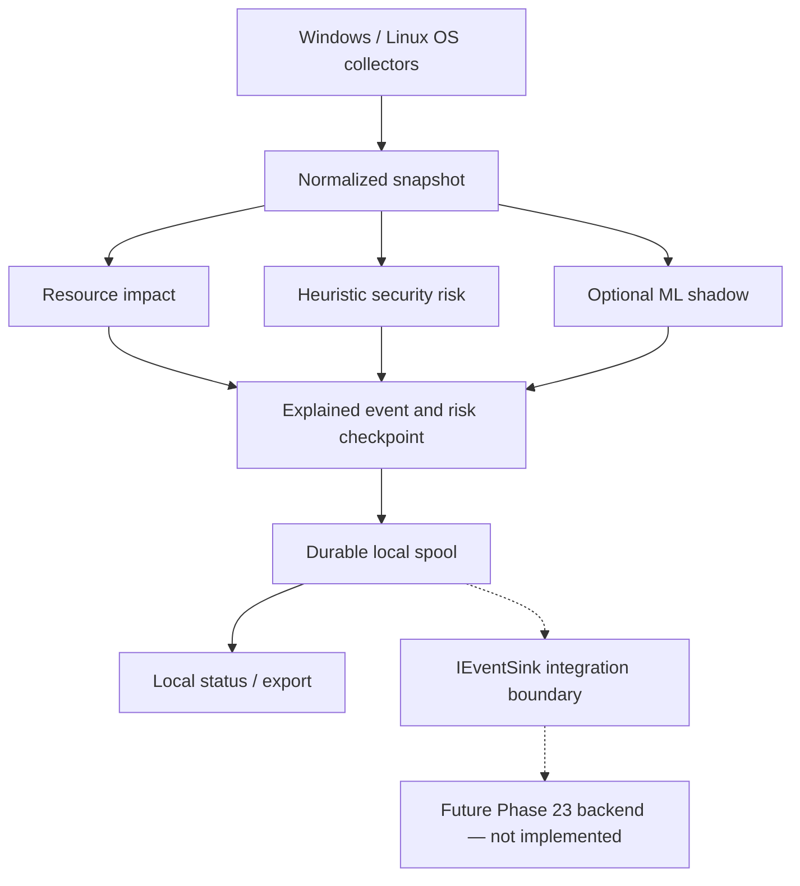

# SentinelZone CryptoGuard

Cross-platform endpoint telemetry and explainable resource-abuse detection for SentinelZone.

**v0.22.2-rc.1 · Release Candidate · PRE-RELEASE · UNSIGNED EVALUATION · NOT PRODUCTION READY**

**High CPU/GPU utilization alone does not mean malware.** CryptoGuard separates `security_risk` from `resource_impact`, preserves missing measurements as `null` with availability status, and collects evidence for review. The heuristic engine is authoritative. ML is **shadow-only**.

## Project Overview

CryptoGuard is the independently maintained Windows/Linux endpoint component of SentinelZone. It collects host/process telemetry, evaluates evidence through a shared heuristic engine, and writes recoverable local events. This repository contains its source, tests, contracts, research tooling and packaging definitions; no parent-repository checkout is required.

Phase 21 covers agents and telemetry. Phase 22 covers risk, explainability and ML shadow. **Phase 23 production backend, enrollment and remote ingestion are NOT IMPLEMENTED BY DESIGN.** There is no production Splunk transport or workload process-kill/persistence-removal system.

## Release Status

| Item | Status |
|---|---|
| Version | `v0.22.2-rc.1` — Release Candidate |
| Distribution | **PRE-RELEASE / UNSIGNED EVALUATION** |
| Readiness | **NOT PRODUCTION READY** |
| Original acceptance | **55 PASS / 0 FAIL / 17 UNVERIFIED / 2 NOT APPLICABLE** |
| ML authority | Shadow-only; heuristics remain authoritative |
| Phase 23 backend | NOT IMPLEMENTED BY DESIGN |
| Hosted GitHub Actions | **UNVERIFIED** |
| Project license | Owner decision pending |

[Original release evidence](docs/release-evidence/v0.22.2-rc.1/README.md) is preserved separately from the new repository-preparation checks in [RELEASE_MANIFEST.md](RELEASE_MANIFEST.md). Supplied measurements are not represented as tests rerun during this handoff.

## Why CryptoGuard Exists

Software builds, rendering, approved AI workloads, antivirus scans, browsers and high-compute applications legitimately consume resources. A utilization spike cannot establish malicious intent or compromise.

CryptoGuard exposes resource cost while evaluating independent security evidence: process identity, executable metadata, network/persistence observations, explicit policy and sustained conditions. Missing coverage limits the conclusion. Risk scores are heuristic scores, **not calibrated compromise probabilities**.

## Core Capabilities

| Capability | Current scope |
|---|---|
| Windows telemetry | Native host/process/network APIs, hash and Authenticode metadata, bounded child collectors |
| Linux telemetry | `/proc`, package-origin metadata, connection ownership, available device sensors |
| CPU/RAM monitoring | Host/process measurements; process CPU is percent of total host capacity |
| Optional GPU/temperature | Windows hardware helper; Linux NVML/hwmon/DRM observations where available |
| Process identity | Agent + boot + PID + creation/start time protects against PID reuse |
| Network observations | Process connections when ownership is available; host rates are not per-process bandwidth |
| Persistence observations | Read-only inventory; no automatic deletion |
| Durable spool | Immutable events, integrity checks, quota/retention accounting and risk reserve |
| Checkpoint/recovery | Atomic risk state and pending-event persistence; recovery regression coverage |
| Explainable heuristics | Reasons, evidence, coverage, unknown data and sustained lifecycle transitions |
| Resource impact | Independent of security risk; unknown measurements remain unknown |
| ML shadow | Optional verified numeric forest; cannot override heuristic decisions |
| Replay/parity | Canonical synthetic JSONL fixtures and deterministic shared evaluation |
| Privacy/redaction | Argument redaction, minimized health/training output and protected service state |

## Architecture



This is a conceptual flow. The shared rule engine computes risk/resource and optional shadow output before persistence. A local fake receiver tests the delivery contract; agents do not deliver to a production backend. See [ARCHITECTURE.md](ARCHITECTURE.md).

## Supported Platforms

| Platform | Evidence and compatibility scope |
|---|---|
| Windows x64 | Native Windows VM evidence; Setup, portable and standalone core payloads |
| Ubuntu/Linux x64 | Ubuntu 24.04 VM acceptance; native AOT ELF, tarball and Debian package |
| Ubuntu 22.04 | Build/container definition exists; not an extension of the final acceptance matrix |
| Other distributions, ARM, macOS | No compatibility claim for this release |

Physical GPU, temperature and interactive idle verification remain open. VM tests do not establish physical-device accuracy.

## Windows Installation

Use the assets from GitHub prerelease `v0.22.2-rc.1` once published. Verify checksums first; they establish byte integrity, not publisher identity. **No CryptoGuard signing claim is made.**

- **Setup EXE:** run as Administrator on an evaluation host. Installs service `SentinelZoneCryptoGuard` under `LocalService`, with delayed automatic startup and recovery settings.
- **Portable ZIP:** extract the entire archive, including `hardware`. Choose a writable `--data` directory.
- **Standalone EXE:** self-contained core agent, with no separate .NET runtime requirement. Optional hardware functionality needs the helper payload from the ZIP/installer.

Binaries install under `%ProgramFiles%\SentinelZone\CryptoGuard\versions\0.22.2-rc.1`; state lives under `%ProgramData%\SentinelZone\CryptoGuard`. Hardware collection is opt-in; CPU hardware sensors additionally require `enable_cpu_hardware`. Missing helper/driver/permission yields `null`/unavailable data while core telemetry continues. The agent installs no hardware driver and does not control fans, voltage or clocks.

Uninstall retains state. Upgrade rollback backups consume additional disk. See [Windows installation](docs/WINDOWS-INSTALL.md).

## Linux Installation

On an evaluation Ubuntu x64 host:

```bash
sudo apt install ./cryptoguard-agent_0.22.2-rc.1_amd64.deb
systemctl status cryptoguard-agent cryptoguard-collector
```

The native AOT binary requires no separate .NET runtime. Package paths are `/usr/lib/cryptoguard/cryptoguard-agent`, `/usr/bin/cryptoguard-agent`, `/etc/cryptoguard/agent.json`, and `/var/lib/cryptoguard`. Two systemd units separate the unprivileged `cryptoguard` core from a restricted root collector using a local Unix socket. Elevated collection remains observational.

The native binary/tarball support standalone evaluation; mark the binary executable when necessary. The tarball does not install services. `apt remove` retains state; `apt purge` intentionally removes package-owned state. See [Linux installation](docs/LINUX-INSTALL.md).

## Quick Start

Start with synthetic replay. From the repository root, use separately downloaded binaries at generic local paths.

Windows PowerShell:

```powershell
& 'C:\CryptoGuard-Evaluation\CryptoGuardAgent.exe' version
& 'C:\CryptoGuard-Evaluation\CryptoGuardAgent.exe' replay --input '.\contracts\replay\high-cpu-benign.jsonl' --data 'C:\CryptoGuard-Evaluation-State'
# Optional bounded local collection; review exports before sharing.
& 'C:\CryptoGuard-Evaluation\CryptoGuardAgent.exe' run --data 'C:\CryptoGuard-Evaluation-State' --duration 60 --capture
& 'C:\CryptoGuard-Evaluation\CryptoGuardAgent.exe' status --data 'C:\CryptoGuard-Evaluation-State'
& 'C:\CryptoGuard-Evaluation\CryptoGuardAgent.exe' export --data 'C:\CryptoGuard-Evaluation-State' --out 'C:\CryptoGuard-Evaluation\new-export.jsonl'
```

Linux Bash (release binary temporarily available in the working directory):

```bash
chmod +x ./cryptoguard-agent-0.22.2-rc.1-linux-x64
./cryptoguard-agent-0.22.2-rc.1-linux-x64 version
./cryptoguard-agent-0.22.2-rc.1-linux-x64 replay contracts/replay/high-cpu-benign.jsonl
# Optional bounded local collection into a fresh private directory.
evaluation_state=$(mktemp -d)
./cryptoguard-agent-0.22.2-rc.1-linux-x64 run --state "$evaluation_state" --samples 12
./cryptoguard-agent-0.22.2-rc.1-linux-x64 status --state "$evaluation_state"
./cryptoguard-agent-0.22.2-rc.1-linux-x64 export --state "$evaluation_state" --output ./new-export.jsonl
```

Export targets must be new files; Windows exports must be outside the state directory. Keep downloaded binaries, runtime state and exports outside the Git source checkout after evaluation.

## Configuration

Windows uses `config.json` in its data directory, or `--config FILE`; a retained legacy `agent.json` can be copied once. Linux uses `/etc/cryptoguard/agent.json` if present, or `--config FILE`. The Linux sample is [packaging/agent.json](packaging/agent.json). Both use snake_case JSON, but platform adapters have different configuration shapes.

| Purpose | Windows | Linux |
|---|---|---|
| Sample/network intervals | `sample_seconds`, `network_seconds` | Same names |
| Hardware interval | `hardware_seconds` | `sensor_seconds` |
| Summary/export interval | `summary_seconds` | `export_seconds` |
| Spool limit | `spool_max_bytes` | `spool_limit_bytes` |
| Priority reserve | `risk_reserve_bytes` | Same name |
| Retention | `retention_days` | `retention_hours` |
| Hardware opt-in | `enable_hardware`, `enable_cpu_hardware` | Available-provider discovery |
| Workload authorization | `authorization` | `authorized_workloads` |
| Optional ML | `ml_shadow_enabled`, `ml_model_path`, `ml_model_sha256` | Same names |

Defaults include 5-second sampling, 256 MiB spool capacity, 32 MiB risk reserve and seven-day retention. ML defaults off. Use local paths and verified hashes, never embedded credentials or lab addresses. See [configuration details](docs/CONFIGURATION.md) before changing policy; do not copy a whole config between OS adapters.

## Telemetry Contract

Wire schema `1.2.0` defines `telemetry`, `inventory`, `risk` and `health`. Envelopes carry `event_uid`, `agent_id`, `sequence`, `observed_at`, `sample_duration_ms` and versions. A PID alone is not a process identity.

Measurements carry value, unit, source and status. Unknown/unsupported/permission/unavailable measurements remain `null`. Host GPU usage is not process GPU usage; interval measurements and aggregated summaries stay distinct. See [contracts](contracts/), [schemas](schemas/), [sample events](contracts/sample-events/) and [TELEMETRY-CONTRACT.md](docs/TELEMETRY-CONTRACT.md).

## Security Risk vs Resource Impact

`security_risk` expresses heuristic concern backed by evidence; `resource_impact` expresses resource cost. An approved render job can have high resource impact and low security risk. Missing resource measurements can leave resource impact `null`. Neither score is a calibrated compromise probability.

Consumers must not turn unknown values into zero, describe unavailable sensors as healthy, or classify high utilization alone as malware. Coverage and `unknown_data` are part of the explanation.

## Explainable Detection

The shared engine combines evidence and policy, records reason codes, and uses sustained conditions and recovery timing for risk lifecycle transitions. Persistence observation does not authorize deletion. Output includes reasons, supporting evidence, assessment source, coverage, lifecycle and ruleset version. See [RISK-ENGINE.md](docs/RISK-ENGINE.md).

## ML Shadow System

The implementation has its own versioned **22-feature contract**, [ml-features.json](contracts/ml-features.json). Its bounded numeric JSON forest format is not a pickle or executable model graph. Loading checks SHA-256, feature order/count/version, finite values, graph validity and limits. Invalid models fail safely; insufficient feature coverage suppresses shadow predictions.

ML is **shadow-only**: `assessment_source=heuristic` stays authoritative. The runtime defaults to no enabled model; **no production model has been accepted**. The historical research model is not an approved runtime default. Host-grouped training and train-only imputation are tested, but synthetic fixture metrics do not prove real-world detection accuracy. See [ML-MODEL.md](docs/ML-MODEL.md) and [ML evaluation](docs/ML-EVALUATION.md).

## Privacy and Secret Handling

Raw passwords, tokens, Authorization/Bearer secrets, connection-string secrets and wallet values must not be persisted. Argument values are omitted/redacted; logs favor exception type/status over raw messages. Health and research outputs minimize sensitive inventory.

Paths, hashes, network endpoints and persistence locations can still be sensitive. Windows hostname behavior differs from Linux's default hostname redaction. Protect state and review exports before sharing. Deliberately fake redaction-test values are documented in [publication checks](docs/PUBLICATION-CHECKS.md). See [PRIVACY.md](PRIVACY.md).

## Build From Source

Use **.NET SDK `10.0.401`**, pinned in [global.json](global.json) with roll-forward disabled, Git, and Python 3.10+ for validation/release tooling. Projects target .NET 10. Install the exact SDK on the build host; a different installed SDK does not satisfy this pin. Preserve [NuGet.Config](NuGet.Config) and profile-specific dependency lock files.

Linux:

```bash
dotnet --version
dotnet restore SentinelZone.CryptoGuard.Linux.slnx --locked-mode --configfile NuGet.Config --disable-parallel -m:1 -p:BuildInParallel=false
dotnet build SentinelZone.CryptoGuard.Linux.slnx -c Release --no-restore -m:1 -p:BuildInParallel=false
# Ubuntu packaging prerequisites; the pinned SDK must already be installed.
sudo apt-get install clang zlib1g-dev build-essential debhelper dpkg-dev fakeroot lintian python3-jsonschema
chmod +x debian/rules debian/postinst debian/postrm
dpkg-buildpackage -b -us -uc
lintian ../cryptoguard-agent_*.deb
```

Debian packaging performs locked Native AOT restore/publish and Linux regression/contract tests. Internal Debian version `0.22.2~rc.1` sorts before stable `0.22.2`; the release asset uses the documented `0.22.2-rc.1` filename.

Windows PowerShell:

```powershell
dotnet --version
dotnet restore SentinelZone.CryptoGuard.Windows.slnx --locked-mode --configfile NuGet.Config
dotnet build SentinelZone.CryptoGuard.Windows.slnx -c Release --no-restore
$iscc = ./packaging/windows/Prepare-Inno.ps1 -Directory "$env:TEMP/CryptoGuard-Inno"
./packaging/windows/Publish.ps1 -Iscc $iscc
```

`Prepare-Inno.ps1` downloads the pinned Inno Setup compiler and checks its hash/signature. `Publish.ps1` builds/tests, publishes the self-contained core and separate hardware payload, and builds Setup with `-Iscc`. Outputs go to ignored `artifacts/`. This does not sign CryptoGuard. See [RELEASE.md](RELEASE.md).

## Testing

C# suites are executable regression harnesses; use the actual `dotnet` commands in [docs/TESTING.md](docs/TESTING.md), not an assumed `dotnet test` adapter. Categories include legacy regression, unified contract, Windows migration/config, schema validation, native replay parity, ML methodology, packaging/lifecycle, resource measurements, soak and reboot.

```bash
python scripts/check-repository.py
python -m unittest discover -s tests/Repository -v
python scripts/secret-scan.py
```

Lifecycle tests install/remove packages and can alter agent state: use disposable evaluation hosts and reviewed backups. Resource smoke tests do not establish 72-hour stability. Never weaken tests to obtain green CI.

## Measured Test Results

Preserved from the **original release bundle**, with scope unchanged:

| Suite | PASS | FAIL | SKIPPED |
|---|---:|---:|---:|
| Windows legacy + unified + migration | 139 | 0 | 0 |
| Linux legacy + unified | 122 | 0 | 0 |
| Native Windows/Linux replay parity | 10 | 0 | Not reported |
| ML training methodology | 6 | 0 | 0 |

Windows is 72 legacy + 59 unified + 8 migration; Linux is 63 legacy + 59 unified. The 15 ML runtime cases per OS are subsets of unified tests, not additional tests. Parity covered 370 rows. See [test-summary.json](docs/release-evidence/v0.22.2-rc.1/validation/test-summary.json). [Preparation results](RELEASE_MANIFEST.md) do not replace these historical measurements.

## Acceptance Status

Preserved component status from the [original acceptance matrix](docs/release-evidence/v0.22.2-rc.1/validation/acceptance-matrix.json):

| Area | Status | Scope |
|---|---|---|
| Windows Agent | PARTIAL | Tested VM behavior; production gates remain |
| Linux Agent | PARTIAL | Tested VM behavior; production gates remain |
| Cross-platform Contract | PASS | Supplied contract/schema cases |
| Packaging | PASS | Supplied VM lifecycle cases; source packaging corrections reported separately |
| Heuristic Risk Engine | PASS | Listed regression/fixture cases |
| Explainability | PASS | Listed evidence/reason cases |
| ML Shadow | PASS | Runtime integrity/isolation; no production model acceptance |
| Detection Evaluation | PARTIAL | Synthetic fixtures and controlled benign simulation |
| False Positive Evaluation | PARTIAL | Synthetic/narrow VM scope; broad real workloads outstanding |
| Hardware — Windows/Linux | PARTIAL | Missing-provider behavior; physical matrix outstanding |
| Replay | PASS | Supplied native parity evidence |
| Spool | PASS | Listed quota/recovery cases; physical disk-full outstanding |
| Migration | PASS | Listed identity/config/state cases |
| Privacy | PASS | Listed redaction cases; exports still require review |

Overall: **55 PASS / 0 FAIL / 17 UNVERIFIED / 2 NOT APPLICABLE**. PASS is limited to the named evidence and does not imply production readiness.

## Known Limitations

Protected/short-lived processes, unloaded user hives, namespaces and permissions can limit coverage. There is no per-process GPU collector. Windows trust uses offline/cache information; Linux package origin is not repository-signature assurance. Legacy spool files and rollback backups consume disk. See [KNOWN-LIMITATIONS.md](docs/KNOWN-LIMITATIONS.md).

## Open Production Gates

All 17 original gates remain **UNVERIFIED**:

1. 72-hour Windows soak.
2. 72-hour Linux soak.
3. Real Windows reboot.
4. Real Linux reboot.
5. Physical NVIDIA GPU.
6. Physical AMD GPU.
7. Physical Intel GPU.
8. Physical GPU without a driver.
9. Physical GPU with blocked permissions.
10. Physical temperature sensors.
11. Interactive desktop idle timing.
12. Broad real-workload evaluation.
13. Physical disk exhaustion.
14. Reference-host CPU/RAM targets over 72 hours.
15. Production ML model acceptance.
16. Code signing.
17. Hosted GitHub Actions execution.

Close gates only with evidence tied to tested source and artifact hashes. Local publication checks do not close product gates.

## Security

See [SECURITY.md](SECURITY.md). Do not post secrets, live spool data or unsanitized endpoint exports in public issues.

## SBOM and Supply Chain

The preserved [sbom.spdx.json](docs/release-evidence/v0.22.2-rc.1/sbom.spdx.json), [SHA256SUMS](docs/release-evidence/v0.22.2-rc.1/SHA256SUMS) and [release-manifest.json](docs/release-evidence/v0.22.2-rc.1/release-manifest.json) describe **original release bytes**, not fresh builds or this source-only ZIP. Checksum paths are relative to the original bundle's `release/` directory.

Dependency lock files, pinned SDK/compiler, full-commit GitHub Action pins, [THIRD-PARTY-NOTICES.txt](THIRD-PARTY-NOTICES.txt), [licenses](licenses/) and [SOURCES.md](SOURCES.md) support traceability. Required corresponding-source ZIPs retain upstream resource files unchanged; they are not CryptoGuard release binaries. Rebuilds require fresh checksums/SBOM evidence. An inventory does not establish signing or select a project license.

## Integration with SentinelZone

The broader integration repository is [SentinelZone-SOC-Platform](https://github.com/Ulvu11/SentinelZone-SOC-Platform). This repository owns CryptoGuard independently; no parent checkout, lab address, personal machine path or production backend is required to use the source.

## Phase 23 Integration Boundary

`IEventSink.AcceptAsync(TelemetryEvent, CancellationToken)` is the future delivery boundary. A sink must acknowledge durable acceptance; `(agent_id, event_uid)` supports deduplication. Sequence, observation time, coverage, privacy and risk/resource semantics must survive transport. Enrollment, production ingestion, credentials and Splunk transport remain **NOT IMPLEMENTED BY DESIGN**. See [PHASE23-HANDOFF.md](docs/PHASE23-HANDOFF.md).

## Repository Structure

```text
SentinelZone-CryptoGuard/
  .github/                 # CI and issue/PR templates
  src/                     # Agents, collectors, contracts, core, risk, ML, replay
  tests/                   # Existing suites and publication regressions
  contracts/               # Canonical schemas, samples and replay fixtures
  schemas/                 # Validation schemas
  rules/                   # Versioned rule metadata
  packaging/               # Windows/Linux/container definitions
  debian/                  # Debian and systemd definitions
  research/                # Dataset/training methodology
  scripts/                 # Release and validation helpers
  docs/                    # Technical docs and scoped historical evidence
  licenses/                # Third-party notices and corresponding source
  global.json
  NuGet.Config
  Directory.Build.props
  SentinelZone.CryptoGuard.Windows.slnx
  SentinelZone.CryptoGuard.Linux.slnx
  README.md
  ARCHITECTURE.md
  RELEASE.md
  RELEASE_MANIFEST.md
  GITHUB_RELEASE_ASSETS.md
  PUSH_TO_GITHUB.md
```

## Contributing

Read [CONTRIBUTING.md](CONTRIBUTING.md). Preserve unknown values, robust process identity, observational persistence and heuristic authority. Use focused regressions for verified defects; report unavailable environments honestly.

## Release Process

See [RELEASE.md](RELEASE.md), [GITHUB_RELEASE_ASSETS.md](GITHUB_RELEASE_ASSETS.md) and [PUSH_TO_GITHUB.md](PUSH_TO_GITHUB.md). Push to an empty `SentinelZone-CryptoGuard` repository, verify actual Actions results, then create prerelease `v0.22.2-rc.1`. Attach prebuilt assets separately with their provenance. Do not commit release binaries or display an unearned green badge.

## License

The project owner has **not yet selected the final repository license**. No MIT, GPL, Apache or other license is asserted for the project's own code. See [LICENSE-TODO.md](LICENSE-TODO.md). Existing third-party licenses, notices and corresponding-source materials remain preserved and apply to their respective components.
